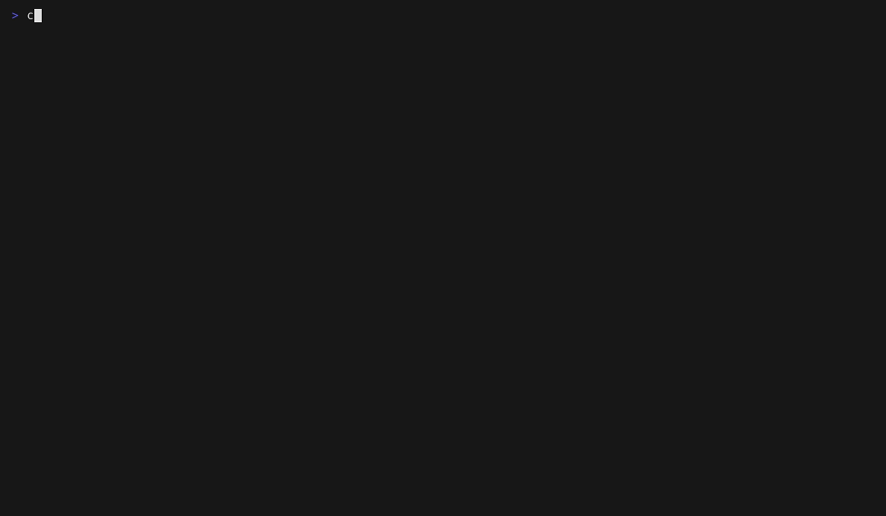

# ossm

`ossm` is a terminal application for discovering, inspecting, installing,
authoring and composing [OpenSpec](https://github.com/Fission-AI/OpenSpec)
workflow schemas.

An OpenSpec schema is a way of working. It declares the artifacts a change
produces, the templates behind them, and the order they depend on each other. A
light schema suits a solo side project; a heavier one with review gates suits a
team. Most OpenSpec users never find out that schemas exist, and those who do
have no easy way to compare one against another or try one out.

ossm is the tool for that, and it is why the
[schema registry](https://github.com/speclib/openspec-schema-registry) exists.


## What it does

**Browse the registry.** Every schema published in the registry, merged with the
schemas OpenSpec ships, searchable, and readable from cache when you are
offline. The status line says how old the cache is.

**Read a schema properly.** Its artifacts, what each produces, the apply gate,
and figures that make two schemas comparable: artifact count, the longest
dependency chain, how many gates stand before apply. `d` draws the dependency
graph.


**See the project you are standing in.** Its default schema, every schema
available to it and where each resolves from, and each change with the schema it
uses. All of it read from OpenSpec and the project's own files; ossm keeps no
record of its own.

**Install one.** `i` on a registry schema shows what would be written where,
refuses to overwrite without a second confirmation, and runs OpenSpec's own
validation afterwards. Nothing is written before you agree, and the project
default is never changed on your behalf.



**Make one yours.** `c` duplicates any schema into a local directory under a new
name. `t` browses its files and `e` opens one in `$VISUAL`, `$EDITOR` or `vi`.
Returning re-reads and re-validates it.

**Compose a new one.** Take the research step from one schema, the review gate
from another and the rest from a third. Add artifacts to a canvas, draw the
`requires` edges from the keyboard, and watch it tell you about cycles,
unresolved requirements and templates that mention artifacts you left out. `w`
writes a standalone schema OpenSpec accepts.


## Running it

With Nix:

```sh
nix run github:speclib/openspec-schema-manager      # run it
nix develop                                          # go, openspec, git, jj, vhs
nix build                                            # ./result/bin/ossm
nix flake check                                      # build, vet, tests, coverage
```

Without:

```sh
go build ./cmd/ossm
./ossm
```

`ossm --help` lists the flags. `--path <dir>` opens a schema folder on launch.

`git` is needed to fetch a schema from the registry. Everything else works
without it.

## Configuration

`$XDG_CONFIG_HOME/ossm/config.yml`, or `~/.config/ossm/config.yml`. Every
setting has a working default, so the file is optional.
[`docs/config.example.yml`](docs/config.example.yml) carries all of them.

```yaml
registry_url: https://registry.speclib.org/api/v1/openspec-schemas.json
registry_ttl: 24h
schemas_dirs:
  - ~/work/openspec-schemas
recents_cap: 20
```

An unknown key is an error rather than a setting that quietly does nothing.

Cached registries and fetched schemas live under `$XDG_CACHE_HOME/ossm/`; the
recents list and composition drafts under `$XDG_STATE_HOME/ossm/`.

## Keys

`?` lists the keys that work wherever you are standing.
[`docs/keys.md`](docs/keys.md) is the same list, generated from the code.

## What it does not do

**It cannot tell you a schema is out of date.** OpenSpec records nothing about
where an installed schema came from, so ossm cannot ask it. `u` on the Project
tab compares an installed schema against the registry and reports whether the
files differ, and says plainly that it cannot tell an upstream change from a
local edit.

**It fetches with git and nothing else.** Every entry in the registry today is a
git repository. There is no raw-file fallback; adding one would mean a
host-specific API under a general name.

**It does not track what you have installed.** That is OpenSpec's job. Every
read goes to the `openspec` CLI and the project's own files.

**OpenSpec's schema commands are experimental** and may change. What ossm
depends on and what it found is in [`NOTES.md`](NOTES.md).

## How the repository is organised

```
cmd/ossm/            main, flags, wiring
internal/config      XDG paths, config.yml, recents
internal/registry    fetch, cache, parse, search, merge built-ins
internal/source      fetch a schema from a source, scan local ones, duplicate, compare
internal/schema      schema.yaml model, parse, validate
internal/graph       the artifact DAG: order, metrics, Mermaid, ASCII rendering
internal/openspec    the adapter over the openspec CLI, and installing
internal/compose     the composer: canvas, edges, template scan, write, drafts
internal/tui         Bubble Tea models, one per screen
test/e2e             the built binary driven on a real pseudo terminal
```

`internal/tui` depends on the others and none of them depends on it; a test in
`internal/arch` enforces that.

`openspec/specs/` holds what ossm is specified to do, and
`openspec/changes/archive/` how it got there. `.beans/` is the tracker: eight
milestones, each closed with what was learned. `NOTES.md` records where real
OpenSpec behaviour differs from the briefing this was built from.

`scripts/coverage-gate.sh` is the single source of truth for what passing means;
`nix flake check` and CI both call it.

## Demos

The GIFs above are recorded from [VHS](https://github.com/charmbracelet/vhs)
tapes in `demo/`. To regenerate them:

```sh
bash demo/setup.sh          # fixtures, a git repository and a demo project
vhs demo/browse.tape
```

Recording needs no network.

## Status

A proof of concept, built milestone by milestone against
[`briefing/BRIEFING.md`](briefing/BRIEFING.md). Every acceptance criterion in
that briefing is a case in `test/e2e/acceptance_test.go`, driving the real
binary.

## Licence

MIT.
